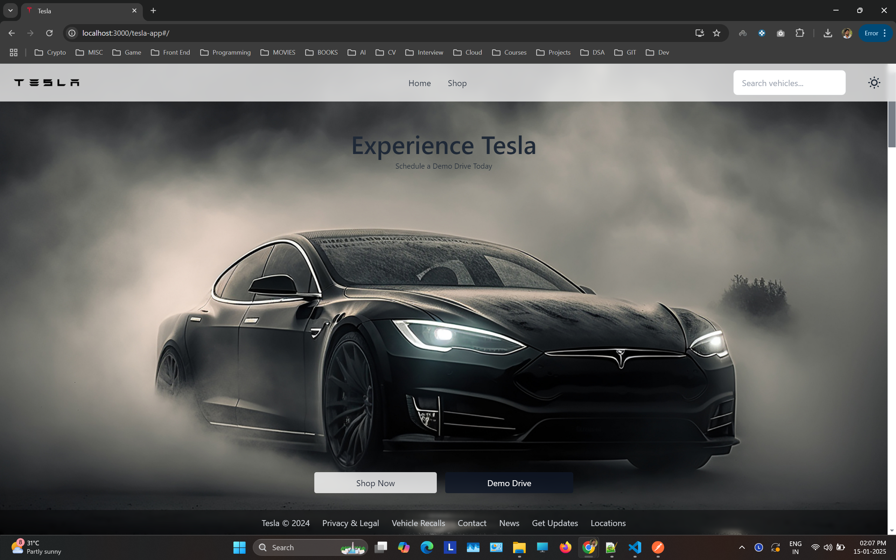
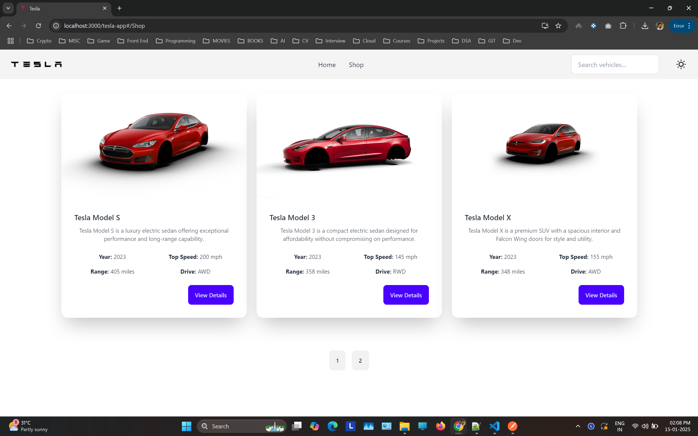
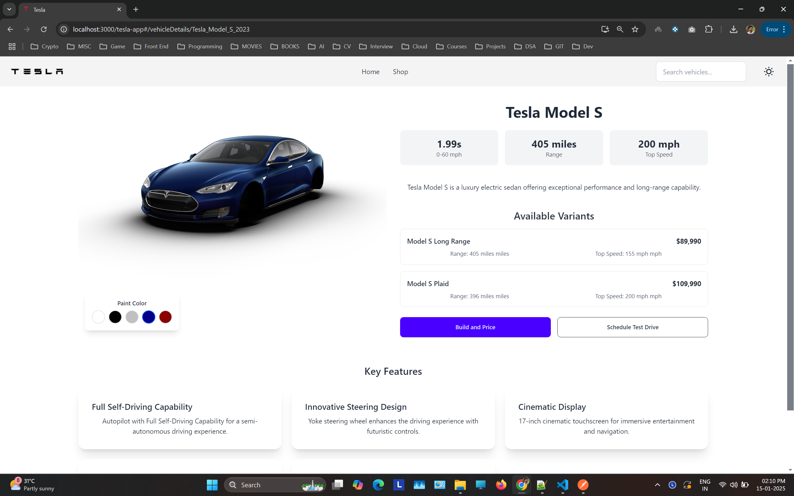
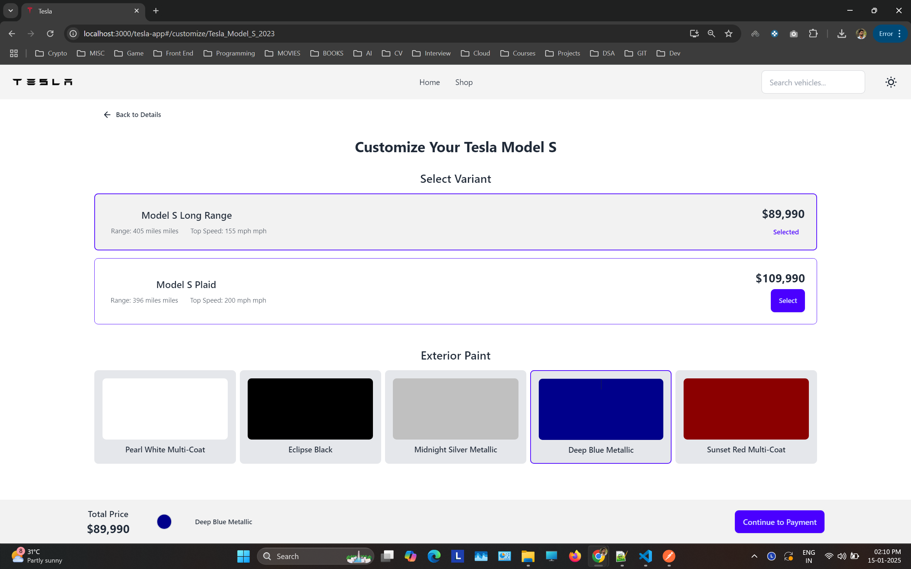
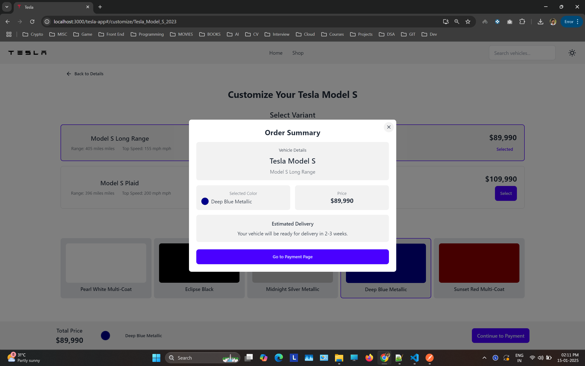
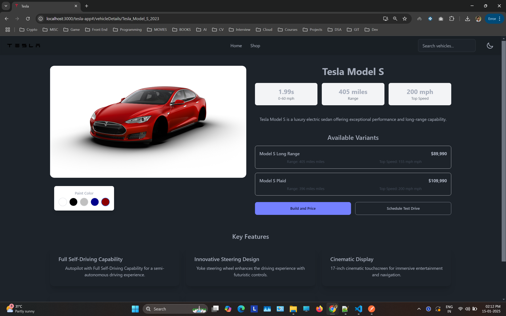
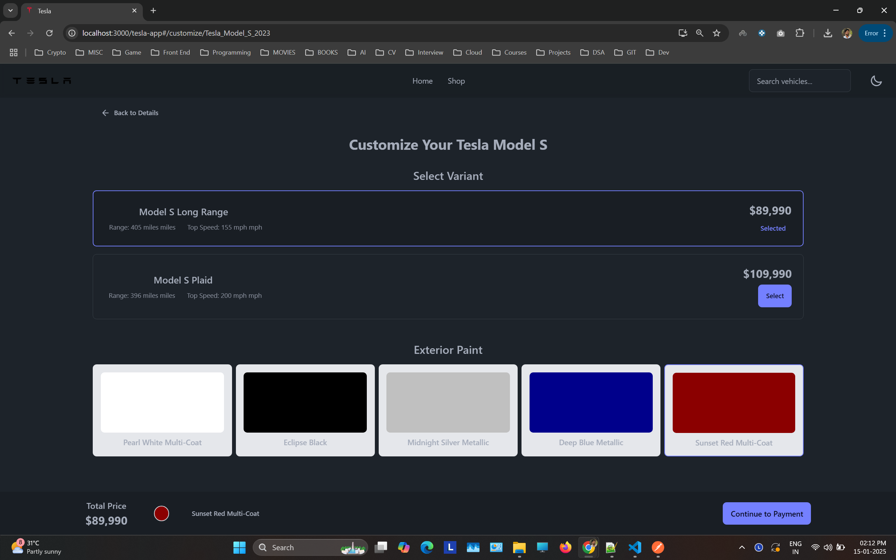
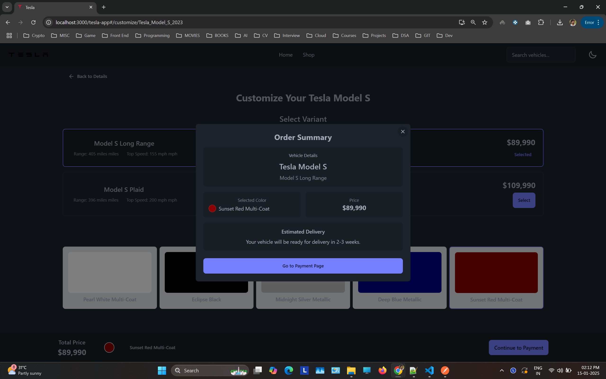
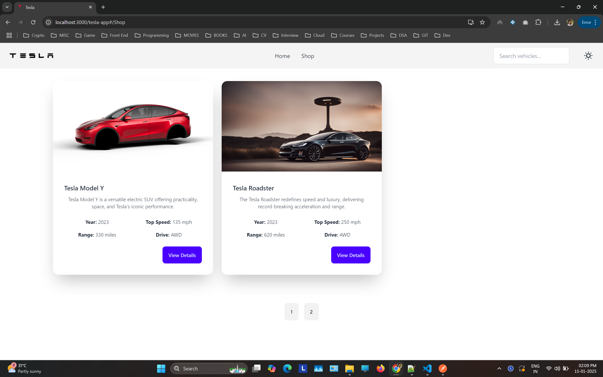

# Tesla Clone App

A React-based Tesla website clone featuring vehicle customization, shopping, and theme switching.

## Live Demo

https://jojugeorge.github.io/tesla-app/#/

## Screenshots

### Landing Page

_The landing page featuring Tesla's signature full-screen design with snap scrolling_

### Vehicle Shop

_Browse through Tesla's vehicle lineup with detailed specifications_

### Vehicle Details

_Detailed view of each vehicle with color selection and key features_

### Customization

_Customize your Tesla with different variants and colors_

### Order Summary

_Order Summary Modal_

### Dark Mode

_Application supports both light and dark themes_

 

## Features

- Responsive design for all screen sizes
- Dynamic color selection
- Dark/Light theme support
- Search functionality
- Image caching for better performance
- Smooth animations and transitions
- Vehicle details with specifications

## API Reference

Vehicle data is fetched from:
https://jojugeorge.github.io/tesla_cars_api/tesla_cars.json

## Local Development

Clone the repository
git clone https://github.com/YourUsername/tesla-app.git
Install dependencies
npm install
Start development server
npm start
Build for production
npm run build

## Technologies Used

- React
- Redux Toolkit
- React Router
- Tailwind CSS
- DaisyUI
- Axios
